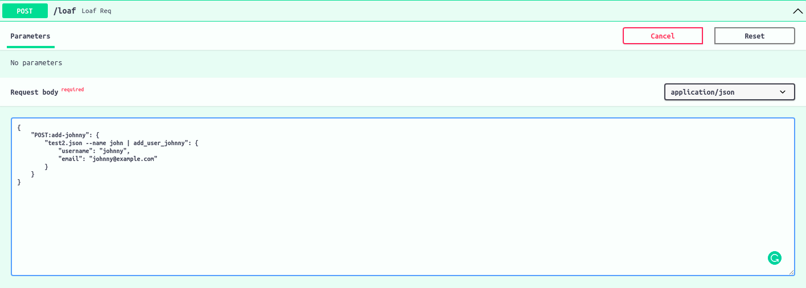
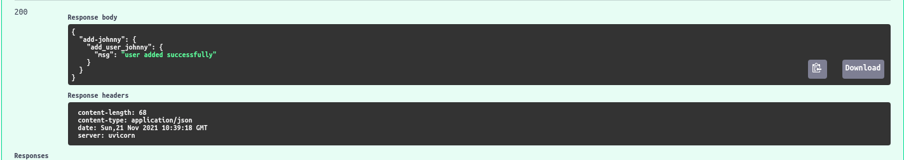
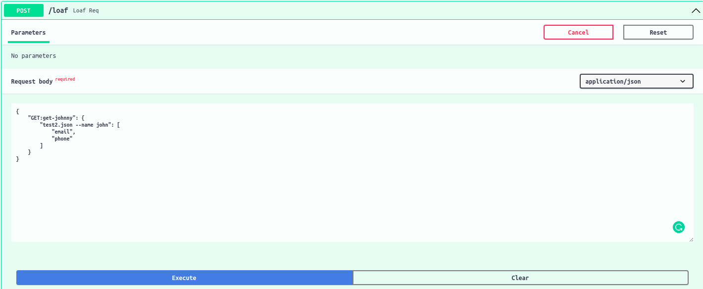
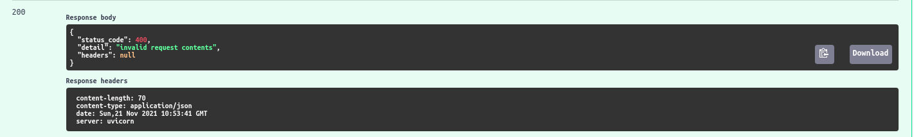

I cannot find a way to explain each part of the parsing process as each thing is interdependent and you cannot talk about one thing without talking about the other.

So here we will go through an example of using `loafang` with [`fastapi`](https://fastapi.tiangolo.com/) and [`tinydb`](https://tinydb.readthedocs.io/en/latest/)


Let's write the code first and then we can talk about what each part does.

### Installation

```commandline
pip3 install loafang fastapi uvicorn tinydb
```

### Let's write some code

```python
# app.py

from argparse import Namespace  # for type hinting purposes only
from typing import Any, Dict, List, Union

from fastapi import FastAPI, HTTPException
from loafang import parse, Methods, MethodsError, QueryBuilder
from tinydb import TinyDB, Query

query_parser = QueryBuilder("database")
query_parser.add_argument("name", type=str)

class RequestMethods(Methods):

    def __init__(self) -> None:
        self.get_query_parser = query_parser
        self.post_query_parser = query_parser  # you can have different parsers
        # for different request methods

    # handle the GET request
    def get(self, args: Namespace, contents: List[str]) -> Any:

        if not all(i in ["username", "email"] for i in contents):
            raise MethodsError(400, "invalid request contents")
            # raise MethodsError when ever you see that something is not right
            #  with the query that you received

        User = Query()

        db = TinyDB(args.database)
        # assumes that the user is in the db
        rd = db.search(User.name == args.name)[0]
        rv = {}

        for c in contents:
            rv[c] = rd[c]

        return rv

    # handle the post request
    def post(self, args: Namespace, contents: Dict[str, Any]) -> Any:
        db = TinyDB(args.database)
        db.insert({"username": contents["username"], "name": args.name, "email": contents["email"]})

        return {"msg": "user added successfully"}


# initialize the server
app = FastAPI()

# vague type of the query the endpoint might receive
JSONObject = Union[Dict[str, Any], List[str]]
req_methods = RequestMethods()

@app.get("/")
def read_root():
    return {"ping": "pong"}

@app.post("/loaf")
def loaf_req(data: JSONObject):
    rd, err, msg = parse(req_methods, data)

    # if something goes whether internally or MethodsError the data returned
    # will be none and the subsequent code and msg will be provided.
    # There are no codes for success.

    return rd if rd else HTTPException(err, msg)
```

Let's run the server
```commandline
uvicorn app:app
```

Now let's send a simple post request

```json
{
    "POST:add-johnny": {
        "test2.json --name john | add_user_johnny": {
            "username": "johnny",
            "email": "johnny@example.com"
        }
    }
}
```


With the current way its setup we will get the following response.



Let's send a request that will cause `MethodsError` defined in get will be raised. Inorder to do that we just need to send a `GET` request with an invalid content.

```json
{
    "GET:get-johnny": {
        "test2.json --name john": [
            "email",
            "phone"
        ]
    }
}
```



Here phone is not a valid content argument.

So we will get following response.


---

So, that's a simple example use case of loafang. If you have any issues feel free to ask it one the discord server, (link in the footer). Or via github issues.

Happy Coding.
